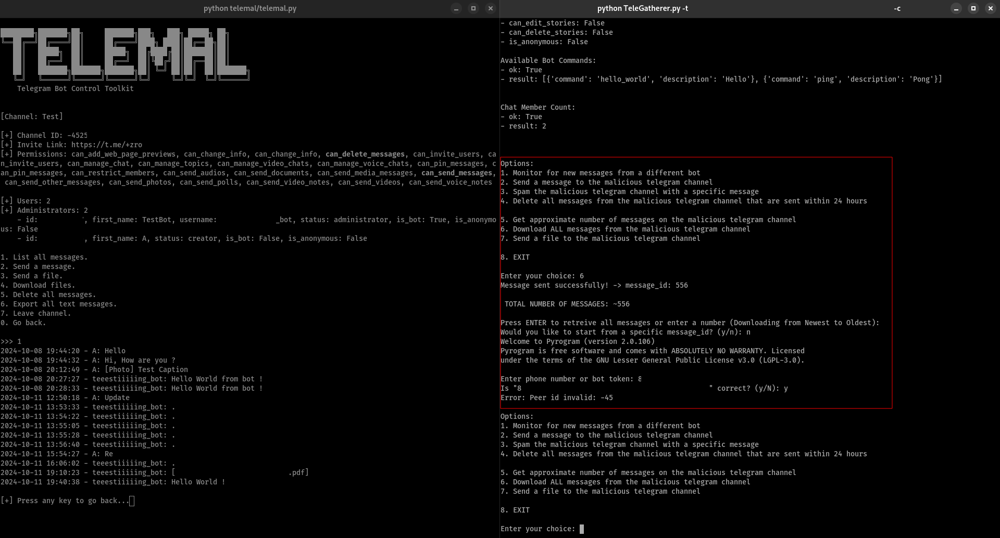

# Telemal

While threat hunting, you may come across a Telegram bot token embedded in an infostealer, used to transmit stolen data to a Telegram channel. By utilizing Telemal, you can efficiently gather intelligence on the malicious channel, leveraging the bot's token to uncover more information.

## Installation

`pip install telemal`

## Features

- List channels the bot is part of (Based on messages received in the last 24 hours). 
- Get basic information on a channel.
- List all messages on a channel.
- Leave channel.
- Download files.
- Send a message.
- Send a file.
- Delete all messages in the last 48 hours.
- Export all text messages.

## How does it work ?

There are two angles of intelligence in this tool :

First, using the [getUpdates](https://core.telegram.org/bots/api#getupdates) API method, we can retrieve messages that the bot can read from the last 24 hours. From that, we can possibly find other channels the bot is in.

Then, to retrieves **all messages** from a channel, we use the [forwardMessage](https://core.telegram.org/bots/api#forwardmessage) API method, which is the only way (that I know of) to retrieve a message from a message_id.
The tool first sends a message to retrieve the last message id. It then forwards all messages from 1 to last_message_id **to the same channel**. Obviously, all messages sent for recon are deleted as soon as they are sent. All messages are also sent with the *disable_notification* option. I will not write that it's impossible for a user to notice the messages being sent then deleted, but it's really hard.

### Limitations

- All messages sent with the *protect_content* option will not be retrieved.
- The bot has to have the *can_delete_messages* permission, or the channel will be flooded with messages from the bot. It shouldn't be a big deal as the goal of this tool is to stop criminals' actions, but it's better to know this.

## Teletracker vs Telemal example

Don't hesitate to ask for more features :)